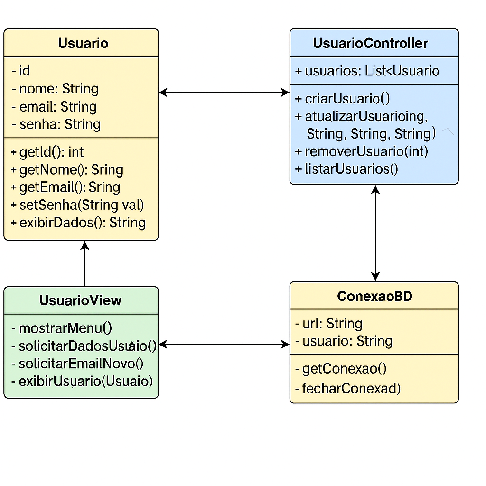
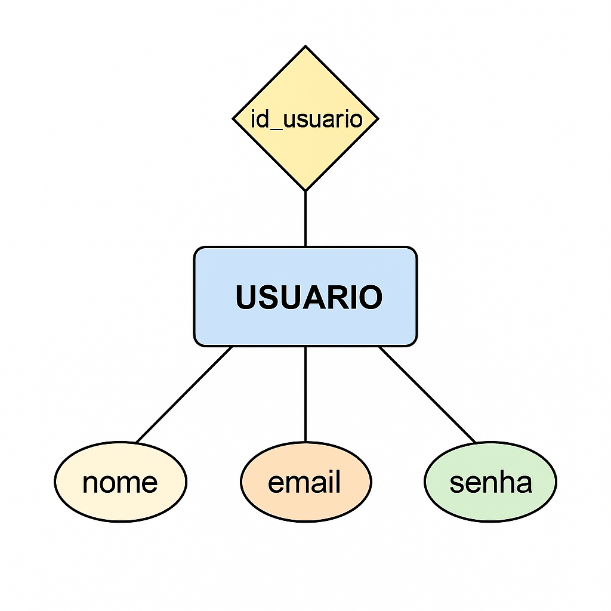

# 📂 Sistema de Gerenciamento de Usuários – POO + MVC (Java)


# Sistema de Gerenciamento de Usuários

## 1. Introdução

Este projeto consiste em um sistema de gerenciamento de usuários, desenvolvido em **Java** aplicando **Programação Orientada a Objetos (POO)** e o padrão arquitetônico **Model-View-Controller (MVC)**.  

O objetivo principal é demonstrar a separação de responsabilidades entre as camadas (Modelo, Visão e Controle), aplicando boas práticas de arquitetura de software e garantindo uma estrutura de código modular e escalável.

---

## 2. Escopo do Projeto

O sistema tem como foco as funcionalidades essenciais de gerenciamento de usuários, com armazenamento de dados em um banco de dados relacional.

### Funcionalidades incluídas
- Cadastro de novos usuários  
- Edição e exclusão de usuários existentes  
- Listagem de todos os usuários cadastrados  
- Autenticação de usuários (**a ser implementada**)  

### Funcionalidades não incluídas
- Integrações com redes sociais  
- Recuperação de senha por e-mail  
- Aplicativos móveis  

---

## 3. Requisitos do Sistema

### Requisitos Funcionais (RF)
- **RF01:** O sistema deve permitir o cadastro de novos usuários.  
- **RF02:** O sistema deve permitir a edição dos dados de um usuário.  
- **RF03:** O sistema deve permitir a exclusão de usuários.  
- **RF04:** O sistema deve listar todos os usuários cadastrados.  
- **RF05:** O sistema deve autenticar usuários com login e senha (escopo futuro).  
- **RF06:** O sistema deve armazenar e recuperar dados de um banco de dados via JDBC.  

### Requisitos Não Funcionais (RNF)
- **RNF01:** O sistema deve ser desenvolvido em Java, utilizando POO e os padrões MVC e DAO.  
- **RNF02:** O sistema deve garantir segurança no armazenamento de dados.  
- **RNF03:** O sistema deve ser modular e de fácil manutenção.  
- **RNF04:** O sistema deve responder às ações do usuário em tempo hábil (até 2 segundos).  

---

## 4. Arquitetura e Estrutura do Projeto

A estrutura de arquivos segue a separação de responsabilidades dos padrões **MVC** e **DAO**.

```plaintext
/src
├── Main.java                     # Classe Main – ponto de entrada do sistema
├── model/
│   └── Usuario.java              # Camada Model – representa a entidade de dados
├── view/
│   └── UsuarioView.java          # Camada View – interação com o usuário (console)
├── controller/
│   └── UsuarioController.java    # Camada Controller – lógica de negócio
└── persistence/
    ├── ConexaoBD.java            # Classe utilitária para conexão com o banco
    └── UsuarioDAO.java           # Camada de Acesso a Dados (operações CRUD)

/docs
├── Diagrama_de_Classes.png
├── Diagrama_Entidade_Re.jpg
└── README.md


## 5. Modelagem do Sistema

### Diagrama de Classes (UML)
O diagrama ilustra a relação entre as classes, destacando a separação de responsabilidades.
*(Sugestão: Atualizar o diagrama para incluir a classe `UsuarioDAO` e as novas relações)*



### Diagrama Entidade-Relacionamento (DER)
O diagrama define a estrutura da tabela `usuario` no banco de dados.




## 6. Tecnologias Utilizadas
* **Linguagem:** Java 17+
* **Banco de Dados:** MySQL
* **API de Persistência:** JDBC (Java Database Connectivity) [cite: 38]
* **Padrões de Arquitetura:** MVC (Model-View-Controller) e DAO (Data Access Object) [cite: 36]
* **Modelagem:** UML e DER

## 7. Como Executar

1.  **Pré-requisitos:**
    * Java JDK 17+ instalado e configurado.
    * Um servidor de banco de dados MySQL em execução.

2.  **Configuração do Banco de Dados:**
    * Crie um banco de dados (ex: `CREATE DATABASE gestao_usuarios;`).
    * Execute o script SQL para criar a tabela `usuario`.
    * Ajuste as credenciais (`URL`, `USUARIO`, `SENHA`) na classe `ConexaoBD.java`.

3.  **Execução:**
    * Compile todos os arquivos `.java` a partir da pasta `/src`: `javac -encoding UTF-8 *.java model/*.java view/*.java controller/*.java persistence/*.java`
    * Execute a classe principal: `java Main`

## 8. Evolução do Projeto (Próximos Passos)

* [x] **Estrutura MVC:** Estrutura inicial clara e organizada.
* [x] **Padrão DAO:** Refatoração da persistência para usar o padrão Data Access Object.
* [x] **Integração JDBC:** Implementação das chamadas SQL (INSERT, SELECT, UPDATE, DELETE) na camada DAO.
* [x] **Validação de Dados:** Adicionar validações para os dados de entrada (ex: formato de e-mail, campos vazios).
* [ ] **Tratamento de Exceções:** Implementar um tratamento de exceções mais robusto na camada de persistência.
* [ ] **Interface Gráfica:** Substituir a interface de console por uma GUI com JavaFX ou Swing.
* [ ] **Testes Unitários:** Desenvolver testes com JUnit para garantir a qualidade do código.
 
---

## 👥 Equipe

* **Jefferson** – Líder técnico e desenvolvedor principal, responsável pela arquitetura do projeto, tomada de decisões estratégicas e implementação das funcionalidades principais.

* **Maria Liliane Vasconcelos Barros** – Auxiliar de desenvolvimento e documentação, tua no suporte ao desenvolvimento, testes e organização da documentação técnica, garantindo clareza e acessibilidade.

* **João Vitor Ruggi Seara** Especialista em desenvolvimento backend e integração de sistemas, revisão de código e mentoria técnica para a equipe.

---

## 📜 Licença

Este projeto é destinado a fins educacionais. Sinta-se à vontade para utilizá-lo como referência, dando os devidos créditos à equipe.

O código-fonte completo deste projeto está disponível no GitHub. Sinta-se à vontade para explorar, clonar e utilizar como referência para seus estudos.

[➡️ Acessar o Repositório no GitHub](https://github.com/jeffersonjaily/A3-PROGRAMA--O-DE-SOLU--ES-COMPUTACIONAIS)